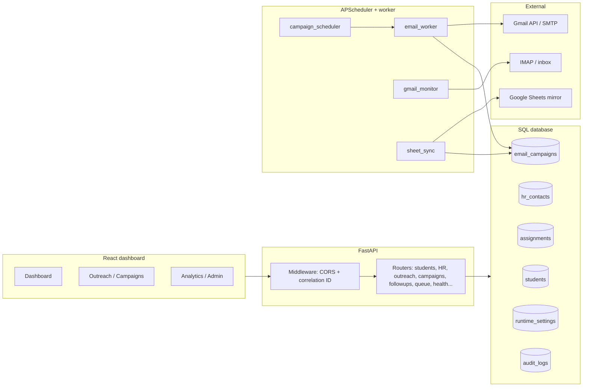
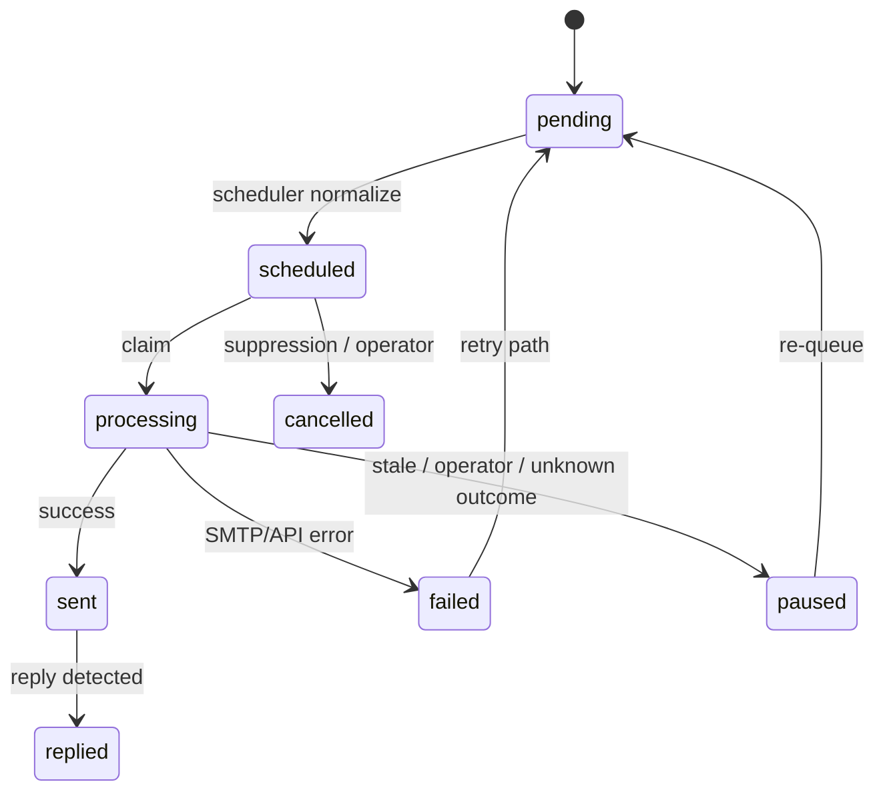

# MicroDegree Outreach — Placement Outreach Automation Platform

**MicroDegree Outreach** is an internal-grade **placement / HR outreach automation** system: it models students and HR contacts, assigns outreach pairs, generates **sequenced email campaigns** (initial + timed follow-ups), runs an **APScheduler**-driven send pipeline (Gmail API with SMTP fallback), **detects replies** over IMAP/Gmail monitoring, classifies outcomes, exports a **mirror** to **Google Sheets**, and exposes a **React operator console** with analytics, admin tools, and **SRE-style reliability** surfaces.

The codebase is engineered for **controlled pilots**: explicit env kill-switches, lifecycle FSMs on `email_campaigns`, idempotent worker claims, fixture isolation in CI, and extensive runbooks under `docs/`.

> **Data & privacy:** This repository does **not** ship real student or HR data. Production databases, OAuth tokens, `credentials.json` / service accounts, and exports are **operator-owned** and must stay out of git (see `.gitignore`). The ORM includes `is_demo` and `include_demo` query flags so UIs can hide synthetic rows. **Google Sheets** integration expects a workbook + service account on the deployment side (`app/services/google_sheets.py` contains a placeholder spreadsheet key for the original deployment—replace for your environment).

---

## Table of contents

1. [Architecture overview](#1-architecture-overview)  
2. [Core features](#2-core-features-comprehensive)  
3. [Operator UI](#3-screens--operator-modules)  
4. [Tech stack](#4-tech-stack)  
5. [Repository structure](#5-repository-structure)  
6. [Local setup](#6-local-setup-windows-friendly)  
7. [Environment variables](#7-environment-variables)  
8. [Database & migrations](#8-database--migrations)  
9. [API overview](#9-api-overview)  
10. [Reliability & safety guarantees](#10-reliability--safety-guarantees)  
11. [Testing](#11-testing)  
12. [Production readiness](#12-production-readiness)  
13. [Roadmap](#13-roadmap)  
14. [Why this project stands out](#14-why-this-project-is-interesting)  
15. [Contributing](#15-contributing)  
16. [License](#16-license)  
17. [Built with engineering principles](#17-built-with-engineering-principles)

---

## 1. Architecture overview

### 1.1 Components

| Layer | Responsibility |
|--------|------------------|
| **FastAPI (`backend/app/main.py`)** | HTTP API, WebSocket log stream, session middleware (OAuth), global exception handlers (incl. DB `503`), CORS, **correlation ID** middleware (`X-Correlation-ID`). |
| **React + Vite (`frontend/`)** | Operator dashboard, analytics views, observability console panels, system reliability page. |
| **PostgreSQL / SQLite** | Primary store via SQLAlchemy 2.x; **Supabase**-compatible URLs (direct `:5432` recommended for Alembic). |
| **APScheduler** | In-process jobs: due campaign dispatch, optional **HR lifecycle**, **Gmail monitor**, **sheet sync** triggers. |
| **Email worker (`app/workers/email_worker.py`)** | Claims rows, sends via **`email_dispatcher`** (Gmail API → SMTP fallback), threading headers, post-send sheet trigger. |
| **Gmail / SMTP / IMAP** | Per-student OAuth; legacy SMTP app passwords; **IMAP** / Gmail API paths for reply ingestion (`gmail_monitor`, `imap_client`). |
| **Google Sheets** | **Mirror-only** export of replies, failures, bounces, blocked HRs; advisory locking + batching in `sheet_sync.py`. |
| **Campaign sequencing** | `campaign_generator` + `EmailCampaign` rows (`initial`, `followup_1`…`followup_3`) with cadence from **initial `sent_at`**: **+7 / +14 / +21 days**. |
| **Follow-up engine** | `followup_eligibility.py` (pure eligibility), `sequence_send_gate.py` (scheduler alignment), `FOLLOWUPS_*` env + **DB `runtime_settings`** dispatch toggle. |
| **Analytics & observability** | `analytics_service`, `observability_metrics` (HTTP + job counters, Prometheus text), `sre_reliability.py` unified JSON payload. |
| **Admin / operator** | Audit logs, backups (`pg_dump` + SQLite), reliability JSON, optional `/debug/*`, fixture bootstrap scripts. |
| **Security & production** | `ADMIN_API_KEY` on sensitive routers, production **fail-fast** for missing secrets, docs: security checklist, reverse proxy, secret rotation, route auth matrix. |

### 1.2 Diagram — request & automation path



### 1.3 Diagram — email campaign lifecycle (simplified)



Full legal transitions are centralized in `app/services/campaign_lifecycle.py` (`LEGAL_EMAIL_CAMPAIGN_TRANSITIONS`).

---

## 2. Core features (comprehensive)

### 2.1 CRM & assignment

- **Students:** CRUD, health metrics, templates (`student_template`), Gmail OAuth linkage, demo flag, **email health** / block signals (`student_email_health`).
- **HR contacts:** CRUD, duplicate email rejection, CSV import (`name, company, email, linkedin, city, source`), listing helpers (e.g. without initial send), **analytics-derived scores**.
- **Assignments:** Student ↔ HR pairing for outreach; integrates with campaign generation.
- **Blocked HRs** (`/blocked-hrs`), **HR ignore** model, **synthetic HR audit** + cleanup scripts for test data hygiene.

### 2.2 Outreach & campaigns

- **Initial outreach:** Manual send, batch send, template labels, **campaign row generation** per assignment.
- **Autonomous follow-up cadence:** Three follow-up steps aligned to **day +7, +14, +21** from **initial send** (`followup_eligibility.py` — `_CUMULATIVE_DAYS_FROM_INITIAL_SENT`).
- **Campaign lifecycle visualization** API (`build_lifecycle_visualization_payload`) for operator diagnostics.
- **Campaign groups** (`Campaign` model, `/campaign-manager`): named grouping of email campaign IDs, pause/resume style operations.
- **Duplicate prevention:** Unique constraint on `(student_id, hr_id, sequence_number)` on `email_campaigns`.

### 2.3 Replies, delivery, and suppression

- **Reply detection** via Gmail monitor job + classification (`reply_classifier`, `reply_normalization`, canonical types: INTERESTED, INTERVIEW, REJECTED, AUTO_REPLY, OOO, BOUNCE, UNKNOWN, etc.).
- **Reply suppression:** Stops follow-ups when the **initial** thread is replied (`sequence_send_gate`, eligibility `REPLIED_STOPPED`).
- **Email threading:** `In-Reply-To` / `References` from prior sent steps (`email_worker._smtp_thread_headers`); `message_id` / `thread_id` / Gmail thread fields on rows.
- **Bounce / failure handling:** SMTP error heuristics → `BOUNCED`, `failure_type`, `delivery_status`; deliverability layer counts bounces; **HR invalidation** hooks (`hr_validity`).
- **Unknown-outcome safeguards:** Stale `processing` → `paused` (scheduler) with **`PAUSED_UNKNOWN_OUTCOME`** terminal family (`campaign_terminal_outcomes.py`); operator reconcile endpoints under `/followups`.

### 2.4 Sequencer v1 & terminal analytics

- **`sequence_state`** on `EmailCampaign` (Autonomous Sequencer v1 migration) — FSM aligned with scheduler + tests (`test_autonomous_sequencer_v1.py`).
- **Terminal outcomes** on pair summary: `REPLIED_AFTER_INITIAL` … `REPLIED_AFTER_FU3`, `NO_RESPONSE_COMPLETED`, `BOUNCED`, `PAUSED_UNKNOWN_OUTCOME`.
- **`overdue_late` / `overdue_first_seen_at`:** Outage-safe marking when scheduler lags (not silent expiry).
- **Sequence suppression** and **`suppression_reason`** text for auditability on cancelled rows.

### 2.5 Priority queue & diagnostics

- **Read-only priority queue** `GET /queue/priority` — weighted blend: follow-up urgency, HR opportunity, HR health, student signals, warm thread (`PRIORITY_W_*` env weights).
- **Over-contact window:** Rolling caps per pair (`PRIORITY_OVER_CONTACT_*`).
- **Diversity layer** (optional `?diversified=true`): HR cap, student floor, exploration %, optional MMR-style rerank (`PRIORITY_DIV_*`, `PRIORITY_DIV_MMR_*`).
- **Scheduler hook flag** `SCHEDULER_USE_PRIORITY_QUEUE` — documented as **optional** future ordering; core scheduler path remains batch due processing.
- **Decision diagnostics** UI route maps to observability console (pair-level reasoning from engine).

### 2.6 Scheduler & workers

- **IST business window** (9:30–17:30) when `ENFORCE_IST_SEND_WINDOW` enabled; jittered delays between sends (`SEND_DELAY_MIN/MAX` in config).
- **HR tier filter** `SCHEDULER_MIN_HR_TIER` integrated with **HR health scoring** (`hr_health_scoring.py`, env-tunable tier boundaries).
- **Deliverability global pause** when `DELIVERABILITY_LAYER=1` (`scheduler_should_pause_sends`).
- **Job metrics:** `GET /health/scheduler/metrics` — last run, duration, errors, missed runs.
- **Admin break-glass:** `POST /campaigns/run_once` (ignores window/time/deliverability — **dangerous**, documented in go-live checklist).

### 2.7 Sheets export intelligence

- Tabs: **Replies**, **Failures**, **Bounces**, **Blocked HRs**; rich headers including `suppression_reason`, `terminal_outcome`, `audit_notes`, sequencer export flag.
- **Postgres advisory lock** (`sheet_sync.py`) to reduce multi-process double-append risk; in-process lock for same-process re-entrancy.
- **Health:** `GET /health/sheet-sync/status` with `SHEET_SYNC_WARN_MINUTES`, `SHEET_SYNC_CRIT_MINUTES`, `SHEET_SYNC_STUCK_MINUTES`.
- **Scripts:** `rebuild_sheet_mirror.py`, export tooling — **DB is source of truth**; sheets are a mirror only (stated in code and DR docs).

### 2.8 Analytics dashboards

- **Summary** endpoints for dashboard KPIs; per-student / per-HR / template analytics routes under `/analytics/*`.
- **Reply workflow** triage: `OPEN` / `IN_PROGRESS` / `CLOSED` on reply rows (`replies` router).

### 2.9 Admin, audit, backups

- **`AuditLog`** append-style events (`audit` router); operator actor headers (`X-Operator-Actor`, `X-Actor`) on dispatch toggle changes.
- **SQLite backup** HTTP endpoints under `/admin` + **Postgres** `backup_pg.py`, `pg_dump_backup.py`, manifests via `backup_health.py`.
- **`GET /admin/reliability`** — single JSON: queues, SMTP rollups, sheet sync fragment, **schema launch gate**, SLO proxy, anomaly hints.
- **`GET /admin/metrics/prometheus`** when `METRICS_EXPORT_ENABLED=1` (still requires admin key when configured).
- **Fixture column bootstrap** (`ensure_fixture_columns`) runs from `init_db` / CLI — launch gate in production readiness doc.

### 2.10 Runtime settings & kill switches

- **Env:** `DISABLE_SCHEDULER`, `FOLLOWUPS_ENABLED`, `FOLLOWUPS_DRY_RUN`, `DEBUG`, deliverability, CORS, etc.
- **DB:** `runtime_settings` + `runtime_settings_store` — e.g. **`followups_dispatch_enabled`** with precedence: env `FOLLOWUPS_ENABLED` ∧ DB toggle at send time (`sequence_send_gate`, `/followups/settings/dispatch`).

### 2.11 Observability & correlation

- **Structured logging** with correlation context (`app/observability/logging_setup.py`, `app/observability/context.py`).
- **HTTP metrics:** method/status/latency (`observability_metrics.py`).
- **WebSocket live logs:** `/ws/logs` — query param `api_key` when admin key configured; **closed in production without key** (`main.py`).

### 2.12 Security controls (product + docs)

- **API key** on students, outreach, campaigns, replies, followups, queue, analytics, assignments, OAuth start routes, etc. (see `docs/ROUTE_AUTH_MATRIX.md`).
- **Production startup** requires `DATABASE_URL`, `SESSION_SECRET_KEY`, `ADMIN_API_KEY` (no dev fallbacks).
- **OAuth state** signing uses `SESSION_SECRET_KEY` or `ADMIN_API_KEY` (`oauth_state.py`).
- **Docs:** `SECURITY_CHECKLIST.md`, `SECURITY_AUDIT.md`, `REVERSE_PROXY_SECURITY.md`, `SECRET_ROTATION_RUNBOOK.md`.

### 2.13 Reliability engineering docs

- `SRE_ARCHITECTURE.md`, `SRE_RUNBOOK.md`, `DISASTER_RECOVERY_RUNBOOK.md`, `INCIDENT_SEVERITY_AND_FMEA.md`, `OPERATOR_RUNBOOK.md`, `DELIVERABILITY_ARCHITECTURE.md`, `PRIORITY_QUEUE.md`, `HR_HEALTH_SCORING.md`, `PRODUCTION_READINESS_REVIEW.md`, `GO_LIVE_CHECKLIST.md`.

### 2.14 Test-fixture pollution protections

- **Pytest:** `PYTEST_RUNNING=1`, forced in-memory SQLite (unless `TEST_DATABASE_URL`), per-test table wipe for shared `:memory:` pool (`conftest.py`).
- **Fixture email guard** — blocks dangerous destinations outside test profile (`fixture_email_guard.py`).
- **CI workflow:** `.github/workflows/backend-fixture-isolation.yml` runs fixture cleanup + email isolation + follow-up eligibility tests.
- **Scripts:** `cleanup_test_fixture_pollution.py`, `purge_residual_fixture_families.py`, `cleanup_synthetic_hr_only.py`, whitelist cleanups, **`fixture_residual_purge`** service used from admin backup paths.

### 2.15 Smaller but real primitives

- **Correlation IDs:** Accept `X-Correlation-ID` / `X-Request-ID`; echo `X-Correlation-ID` on responses.
- **Schema launch gate:** `GET /health/schema-launch-gate` + embedded in `/admin/reliability` (`schema_launch_gate.py` — critical tables include `runtime_settings`).
- **Legacy route compatibility:** `/email-logs` → outreach logs; `/followup1/send` → outreach send alias.
- **Notifications** API with dedupe for display (`notification_dedupe.py`).
- **Interviews** router for placement pipeline tracking.
- **Responses** router for structured response capture linked to campaigns.

---

## 3. Screens & operator modules

Primary navigation (`Sidebar.tsx`) and observability standalones:

| UI area | Route(s) | Purpose |
|---------|-----------|---------|
| **Dashboard** | `/` | KPIs, charts, recent campaigns, health + scheduler snapshot. |
| **Students** | `/students` | Student records, templates, OAuth, health. |
| **HR Contacts** | `/hr-contacts` | Directory, import, validity. |
| **Outreach** | `/outreach` | Send / batch actions, pairing context. |
| **Campaigns** | `/campaigns` | Row-level email campaigns, lifecycle patches. |
| **Follow-ups** | `/followups` | Eligibility, dispatch settings, operator tools (client hits `/followups/*` API). |
| **Replies** | `/replies` | Inbox-style triage, classifications, workflow status. |
| **Email Logs** | `/email-logs` | Operational log view (API alias to outreach logs). |
| **Analytics** | `/analytics/students`, `/analytics/hrs`, `/analytics/templates` | Sliced metrics. |
| **Admin Tools** | `/admin`, `/admin/observability?panel=…` | Overview + observability console hub. |
| **Priority queue** | `/priority-queue` or admin panel `priority-queue` | Ranked work queue. |
| **Decision diagnostics** | `/decision-diagnostics` | Deep reasons / engine output. |
| **Campaign lifecycle** | `/campaign-lifecycle` | Visualize state transitions. |
| **System reliability** | `/system-reliability` | SRE JSON surfaced for operators (`/admin/reliability`-backed). |
| **System status** | `/settings` | Config / status (incl. scheduler, env hints). |

---

## 4. Tech stack

**Backend**

- Python 3.12, FastAPI, Uvicorn, SQLAlchemy 2.x, Alembic, Pydantic v2  
- APScheduler, Google Auth / Gmail API clients, `httpx`, pytest  
- PostgreSQL (`psycopg2-binary`) or SQLite for dev/tests  

**Frontend**

- React 18, Vite 5, TypeScript (mixed with JSX pages), React Router 6  
- TanStack Query, Axios, Tailwind + shadcn/Radix, Recharts, Framer Motion, Zod, react-hook-form  
- Vitest + Testing Library for unit/component tests  

**Ops & quality**

- Docker (`backend/Dockerfile`, root `docker-compose.yml`)  
- GitHub Actions (fixture isolation gate)  
- OpenAPI at `/docs` (FastAPI default)  

---

## 5. Repository structure

```
placement-outreach-system/
├── backend/                 # FastAPI application (run from here)
│   ├── app/
│   │   ├── main.py          # App factory, middleware, router mount table
│   │   ├── config.py        # Dotenv load order, feature flags
│   │   ├── auth.py          # ADMIN_API_KEY, production detection
│   │   ├── routers/         # HTTP route modules (students, outreach, campaigns, …)
│   │   ├── models/          # SQLAlchemy models
│   │   ├── services/        # Domain logic (scheduler, eligibility, sheets, SRE, …)
│   │   ├── workers/         # email_worker
│   │   ├── database/        # engine, init_db, fixture guards, bootstrap
│   │   ├── observability/   # logging + correlation context
│   │   └── scripts/         # Operator/maintenance CLIs
│   ├── alembic/             # Migrations (versions/*.py)
│   ├── tests/               # pytest suite + fixtures
│   ├── requirements.txt
│   └── Dockerfile
├── frontend/                # Vite React dashboard
│   └── src/
│       ├── pages/           # Route-level screens
│       ├── components/      # UI + layout
│       ├── api/             # Typed-ish API clients (axios)
│       └── lib/             # ROUTES, API_BASE_URL, breadcrumbs
├── docs/                    # Security, SRE, DR, API config, priority queue, …
├── .github/workflows/       # CI
├── docker-compose.yml
├── DEPLOYMENT.md
└── README.md
```

---

## 6. Local setup (Windows-friendly)

### 6.1 Prerequisites

- Python **3.12**  
- Node.js **18+** (20 LTS recommended)  
- Git  

Optional: Docker Desktop if you prefer containerized API.

### 6.2 Backend

```powershell
cd backend
python -m venv venv
.\venv\Scripts\Activate.ps1
pip install -r requirements.txt
copy .env.example .env     # from backend\ — see comments inside backend\.env.example; optional repo-root .env for shared keys
# Minimum for local open dev: DATABASE_URL (optional — SQLite default path may be created), leave ADMIN_API_KEY empty for open routes
uvicorn app.main:app --reload --port 8010
```

Bash equivalent:

```bash
cd backend && python -m venv venv && source venv/bin/activate
pip install -r requirements.txt
uvicorn app.main:app --reload --port 8010
```

API root: `http://127.0.0.1:8010` — OpenAPI: `http://127.0.0.1:8010/docs`.

### 6.3 Frontend

```powershell
cd frontend
npm install
npm run dev
```

Dashboard: `http://127.0.0.1:5173` — set `VITE_API_BASE_URL=http://127.0.0.1:8010` (see `frontend/src/lib/constants.ts`).

### 6.4 Database & migrations

- **SQLite:** zero-config for quick dev (path per `DATABASE_URL`).  
- **Postgres / Supabase:** set `DATABASE_URL`; for Alembic against pooler issues use `ALEMBIC_DATABASE_URL` with direct port **5432** (see `backend/.env.example` comments).

```powershell
cd backend
.\venv\Scripts\Activate.ps1
alembic upgrade head
```

Optional: `ALEMBIC_UPGRADE_ON_START=1` runs upgrade on API startup (async; see `main.py`).

### 6.5 Scheduler

The scheduler starts **inside the API process** unless `DISABLE_SCHEDULER=1`. No separate worker process is required for the default architecture.

### 6.6 Tests

```powershell
cd backend
.\venv\Scripts\Activate.ps1
pytest
```

Frontend:

```powershell
cd frontend
npm test
```

### 6.7 Docker

From repo root:

```powershell
docker compose up -d --build
```

Binds **8010** per `docker-compose.yml`. Provide `backend/.env` with required variables for your profile.

### 6.8 Gmail / Sheets (optional local)

- Create Google Cloud **OAuth Web client** credentials → `GOOGLE_CLIENT_ID` / `GOOGLE_CLIENT_SECRET`.  
- Authorized redirect: `http://127.0.0.1:8010/oauth/gmail/callback` (and production URL when deployed).  
- Sheets: place service account JSON as `credentials.json` in **`backend/`** working directory (default `google_sheets.py` path) and grant sheet access — **never commit** this file.

---

## 7. Environment variables

Values are documented inline in **`backend/.env.example`**. Grouped index:

### Database & pool

| Variable | Role |
|----------|------|
| `DATABASE_URL` | SQLAlchemy URL (Postgres or SQLite). |
| `TEST_DATABASE_URL` | pytest optional real-DB URL (CI). |
| `ALEMBIC_DATABASE_URL` | Non-pooler URL for migrations. |
| `ALEMBIC_UPGRADE_ON_START` | Run `alembic upgrade head` at startup. |
| `DB_POOL_SIZE`, `DB_MAX_OVERFLOW`, `DB_POOL_RECYCLE`, `DB_POOL_TIMEOUT` | Pool tuning (`app/database/config.py`). |
| `DB_CONNECT_TIMEOUT`, `DB_TCP_KEEPALIVE`, `DB_KEEPALIVES_*` | TCP / keepalive for Postgres. |

### Runtime / server

| Variable | Role |
|----------|------|
| `APP_ENV` / `ENV` / `ENVIRONMENT` | `dev`/`local`/`test` vs production-like (secrets enforcement). |
| `PORT` | Listen port (Docker default `8010`). |
| `CORS_ALLOW_ORIGINS`, `CORS_ALLOW_ORIGIN_REGEX` | Production CORS lockdown. |
| `FRONTEND_URL` | OAuth return + warnings if unset in prod. |
| `SESSION_SECRET_KEY` | Starlette sessions + OAuth state signing. |
| `ADMIN_API_KEY` | Operator API key (`X-API-Key` / `X-Admin-Key`). |
| `DEBUG` | Mounts `/debug/*` when true. |
| `LOG_LEVEL` | Root log level. |
| `PYTEST_RUNNING` | Set by pytest harness (dotenv override behavior). |

### Email & OAuth

| Variable | Role |
|----------|------|
| `GOOGLE_CLIENT_ID`, `GOOGLE_CLIENT_SECRET` | Gmail OAuth. |
| `OAUTH_REDIRECT_URI` | Optional override (defaults in `gmail_oauth.py`). |
| `DAILY_INITIAL_EMAIL_LIMIT` | Legacy env knob (see `config.py`; **hard daily caps are not enforced** in current scheduler paths). |
| `ENFORCE_IST_SEND_WINDOW` | Business hours gate. |

### Scheduler & sequencing

| Variable | Role |
|----------|------|
| `DISABLE_SCHEDULER` | Kill-switch for in-process scheduler. |
| `SCHEDULER_MIN_HR_TIER` | Minimum HR tier (A–D) for sends. |
| `SCHEDULER_USE_PRIORITY_QUEUE` | Feature flag for future priority ordering hook. |
| `SEQUENCE_OVERDUE_LAG_MINUTES` | Overdue / sequencer lag tuning (`campaign_scheduler.py`). |

### Follow-ups

| Variable | Role |
|----------|------|
| `FOLLOWUPS_ENABLED` | Master env enable for follow-up sends. |
| `FOLLOWUPS_DRY_RUN` | When true, manual send API can report `dry_run: true` without Gmail. |

### Sheets

| Variable | Role |
|----------|------|
| `SHEET_SYNC_WARN_MINUTES`, `SHEET_SYNC_CRIT_MINUTES`, `SHEET_SYNC_STUCK_MINUTES` | Health thresholds for pending export age / stuck detector. |

### Observability & SRE

| Variable | Role |
|----------|------|
| `METRICS_EXPORT_ENABLED` | Expose `GET /admin/metrics/prometheus`. |
| `SRE_ALERT_BOUNCE_1H_THRESHOLD`, `SRE_ALERT_REPLY_RATE_MIN`, `SRE_ALERT_SCHEDULER_STALL_SECONDS`, `SRE_ALERT_FOLLOWUP_BACKLOG`, `SRE_ALERT_SEQUENCER_OVERDUE_LATE` | Anomaly hint thresholds in `sre_reliability.py`. |
| `SLO_SEND_SUCCESS_TARGET` | Error-budget style proxy in reliability JSON. |

### Deliverability (optional layer)

| Variable | Role |
|----------|------|
| `DELIVERABILITY_LAYER` | Master enable. |
| `DELIVERABILITY_BOUNCE_WINDOW_HOURS`, `DELIVERABILITY_BOUNCE_SUPPRESS_THRESHOLD`, `DELIVERABILITY_SPAM_BLOCK_SCORE`, `DELIVERABILITY_MIN_REPUTATION_SCORE`, `DELIVERABILITY_WARMUP_MAX_SENDS_PER_DAY`, `DELIVERABILITY_WARMUP_STUDENT_DAYS`, `DELIVERABILITY_WARMUP_FRESH_STUDENT_DAY_CAP`, `DELIVERABILITY_MIN_SECONDS_BETWEEN_SENDS`, `DELIVERABILITY_GLOBAL_PAUSE_*`, `DELIVERABILITY_REPLY_SIGNAL_DAYS`, `DELIVERABILITY_SENDER_DOMAINS` | Heuristic tuning (`deliverability_layer.py`). |

### Priority queue & diversity

| Variable | Role |
|----------|------|
| `PRIORITY_W_FOLLOWUP`, `PRIORITY_W_HR_OPP`, `PRIORITY_W_HR_HEALTH`, `PRIORITY_W_STUDENT`, `PRIORITY_W_WARM` | Weighting. |
| `PRIORITY_OVER_CONTACT_DAYS`, `PRIORITY_OVER_CONTACT_SOFT`, `PRIORITY_OVER_CONTACT_HARD` | Caps. |
| `PRIORITY_QUEUE_MAX_ASSIGNMENTS_SCAN` | Safety / performance cap (large DBs: ordering approximate). |
| `PRIORITY_DIV_HR_CAP`, `PRIORITY_DIV_STUDENT_FLOOR`, `PRIORITY_DIV_EXPLORATION_PCT`, `PRIORITY_DIV_MMR_ENABLED`, `PRIORITY_DIV_MMR_LAMBDA`, `PRIORITY_DIV_MMR_WINDOW` | Diversity layer. |

### HR health scoring

| Variable | Role |
|----------|------|
| `HR_HEALTH_BOUNCE_SOFT`, `HR_HEALTH_BOUNCE_HARD`, `HR_TIER_*`, `HR_TIER_D_*` | Tier boundaries (`hr_health_scoring.py`). |

### Backups & tooling

| Variable | Role |
|----------|------|
| `BACKUPS_DIR` | Artifact directory for dumps / manifests. |
| `PG_DUMP_BIN`, `PG_RESTORE_BIN` | Binary paths for backup scripts. |

### Frontend (Vite)

| Variable | Role |
|----------|------|
| `VITE_API_BASE_URL` (preferred) / `VITE_API_URL` | Backend origin for Axios. |
| `VITE_ADMIN_API_KEY` | Sent as `X-API-Key` when set (`frontend/src/api/api.ts`). |

### Lint / dev hygiene

| Variable | Role |
|----------|------|
| `LEGACY_LOG_DEPRECATION_CHECK` | Startup guard for deprecated logging paths. |

---

## 8. Database & migrations

- **Tooling:** Alembic, `backend/alembic/versions/*.py`.  
- **Run:** `cd backend && alembic upgrade head` (uses `ALEMBIC_DATABASE_URL` or `DATABASE_URL` per `alembic/env.py`).  
- **Bootstrap:** `init_db` invokes fixture column bootstrap for dev/test parity.  
- **Launch gate:** `python -m app.scripts.ensure_fixture_columns --verify-only` (see production readiness doc).  
- **Important domains:** `email_campaigns` (queue + reply + export flags), `runtime_settings`, `audit_logs`, `students`, `hr_contacts`, `assignments`, `campaigns` (group table).

---

## 9. API overview

Grouped by router prefix (all under API host unless noted). Many routes require **`X-API-Key`** when `ADMIN_API_KEY` is set.

| Domain | Prefix | Highlights |
|--------|--------|------------|
| Students | `/students` | CRUD, templates, health rows. |
| HR | `/hr`, `/hrs` (legacy) | CRUD, CSV, scores. |
| HR compat | `/hr-contacts` | Dashboard-aligned paths. |
| Assignments | `/assignments` | Pairing. |
| Outreach | `/outreach` | Send, batch, logs, stats. |
| Campaigns | `/campaigns` | List/patch rows, lifecycle visualization. |
| Campaign manager | `/campaign-manager` | Campaign **groups**. |
| Follow-ups | `/followups` | Eligibility, preview, send, reconcile, **dispatch settings**. |
| Priority queue | `/queue` | `GET /queue/priority`, summary-only variants. |
| Replies | `/replies` | List + patch triage, backfill helpers. |
| Analytics | `/analytics` | Summary + dimensional analytics. |
| Notifications | `/notifications` | In-app notifications. |
| Interviews | `/interviews` | Interview tracking. |
| Responses | `/responses` | Structured responses. |
| Audit | `/audit` | List (admin key strict), clear (dangerous). |
| Admin | `/admin` | Logs, backups, backup-health, **reliability**, Prometheus. |
| Health | `/health` | DB ping, scheduler status/metrics, sheet-sync status, **schema-launch-gate**, config snapshot. |
| OAuth | `/oauth/gmail`, `/auth/google` | Gmail OAuth (mixed `require_api_key` on start). |
| Blocked HR | `/blocked-hrs` | Blocklist CRUD. |
| Debug | `/debug` | `DEBUG=1` only. |

**Aliases:** `/scheduler/status`, `/email-logs`, `/followup1/send`, `/ws/logs`.

---

## 10. Reliability & safety guarantees

- **Idempotency:** Worker claim uses SQL `UPDATE … WHERE status IN ('scheduled','pending')` pattern; `sent` self-loop allowed for repair (`campaign_lifecycle.py`).  
- **Stale `processing`:** Scheduler demotes to `paused` with explicit bulk reason (unknown outcome protection).  
- **Follow-up gating:** Env + DB toggle + prior-step-sent + initial-replied checks (`sequence_send_gate.py`).  
- **Pause semantics:** Operator bulk PATCH + runtime paused state with legal transitions to `pending` for re-queue.  
- **Duplicate send prevention:** Unique sequence per pair; gates on status before claim.  
- **Fixture leak guards:** `PYTEST_RUNNING`, in-memory DB reset, email domain guard, CI workflow.  
- **Sheet sync:** Advisory lock + batch retries; stuck detector in health payload.  
- **503 on DB pooler blips:** `OperationalError` handler in `main.py`.  
- **Production secret enforcement:** Missing `DATABASE_URL` / `SESSION_SECRET_KEY` / `ADMIN_API_KEY` → startup failure.

---

## 11. Testing

| Area | Tests (examples) |
|------|-------------------|
| Fixture isolation | `test_fixture_email_isolation.py`, `test_fixture_cleanup_verification.py`, `test_ci_fixture_tag_enforcement.py` |
| Follow-ups | `test_followup_eligibility.py`, `test_followup_send_collision.py` |
| Priority queue | `test_priority_queue_engine.py`, `test_priority_queue_diversity.py`, `test_priority_queue_followup_invariants.py` |
| Lifecycle / sequencer | `test_campaign_lifecycle_invariants.py`, `test_autonomous_sequencer_v1.py` |
| Deliverability | `test_deliverability_layer.py` |
| SRE / health | `test_sre_reliability_payload.py`, `test_health_and_analytics.py`, `test_metrics_prometheus_endpoint.py` |
| Correlation | `test_correlation_id_middleware.py` |
| Email safety | `test_email_header_sanitization.py` |
| DR / backup | `test_backup_pg_restore_verify.py`, `test_restore_hr_contacts_snapshot.py` |
| HR / scoring | `test_hr_health_scoring.py`, `test_synthetic_hr_audit.py` |
| Runtime settings | `test_runtime_settings_resilience.py` |
| DB integrity | `test_db_integrity_checks.py`, `test_fixture_column_bootstrap.py`, `test_fixture_residual_purge_safety.py` |

---

## 12. Production readiness

- **Principal-engineer review:** `docs/PRODUCTION_READINESS_REVIEW.md` — conditional go for **controlled pilot**; explicit no-go items (open API in prod, no backups, etc.).  
- **Go-live checklist:** `docs/GO_LIVE_CHECKLIST.md` — env, auth, dry-run semantics, health probes, rollback.  
- **Deployment:** `DEPLOYMENT.md` + Docker.  
- **Edge:** TLS, rate limits, header hardening — **reverse proxy** responsibility (`docs/REVERSE_PROXY_SECURITY.md`).  
- **Chaos / failure drills:** enumerated in production readiness doc (kill mid-send, block DB, invalid SMTP, etc.).

---

## 13. Roadmap

**Implemented today**

- Full placement loop: students, HR, assignments, campaigns, scheduler sends, reply detection, analytics, sheets mirror, audit, backups, SRE payloads, priority queue + diversity, follow-up eligibility + toggles, deliverability layer (optional), HR health tiers, notifications, interviews.

**In design / partial / future**

- **Autonomous policy layer** (`docs/AUTONOMOUS_OUTREACH_AGENT.md`): simulation-first, human approval, optional executor behind feature flag — not a turnkey autonomous SaaS yet.  
- **Horizontal workers + queue** (Redis/SQS-class) for send isolation — called out in production readiness as scale path.  
- **Persistent metrics / tracing** store (vs in-process counters).  
- **RBAC** beyond single shared admin key.  
- **Scheduler consumes priority queue ordering** when `SCHEDULER_USE_PRIORITY_QUEUE` is fully wired for all selection paths (today: documented incremental / optional).

---

## 14. Why this project is interesting

This is not a demo CRUD app: it is a **small distributed system** compressed into a monolith—**state machines** on email rows, **two-layer kill switches** (env + DB), **financial-audit-style** append logs, **SRE JSON** designed for real operators, **CI gates** against test pollution, and **honest production documentation** that names SPoFs and scaling ceilings. It shows you can reason about **blast radius** (email), **idempotency**, and **operability** together—skills that transfer directly to platform and B2B SaaS teams.

---

## 15. Contributing

1. Open an issue or draft PR describing the change (operator-facing behavior deserves a runbook note).  
2. Run **`pytest`** and relevant **`npm test`** / **`npm run lint`**.  
3. Follow existing patterns: router thin, logic in `services/`, transitions only via `campaign_lifecycle` where applicable.  
4. Never commit secrets, real exports, or production URLs with tokens.  
5. Update **`backend/.env.example`** when adding env vars.

---

## 16. License

**License TBD** — replace this section with your chosen SPDX license (e.g. MIT, Apache-2.0) and add a `LICENSE` file before public launch.

---

## 17. Built with engineering principles

- **Single source of truth** for campaigns: `email_campaigns` only — legacy duplicate log paths explicitly deprecated in model docstring.  
- **Explicit over implicit** for sends: dry-run flags, dispatch checksum endpoints, legal FSM transitions in one module.  
- **Defense in depth:** API key + production env gate + fixture guards + deliverability + scheduler metrics.  
- **Operability first:** health routes, `/admin/reliability`, runbooks, and checklist-driven launch—not an afterthought.

---

**Self-check:** Major subsystems covered include students/HR/assignments, outreach & campaign groups, **sequenced follow-ups (+7/+14/+21)**, reply pipeline & triage, **terminal outcomes + sequencer FSM**, priority queue + diversity, scheduler + worker claims, **Gmail/SMTP/IMAP**, **Sheets mirror + sync health**, analytics, **notifications & interviews**, audit + runtime settings, **observability + Prometheus**, schema launch gate, **fixture/CI safety**, backup/restore scripts, and **documentation corpus** for security and SRE.

If you extend the codebase, update this README’s **API**, **env**, and **roadmap** sections in the same PR.
